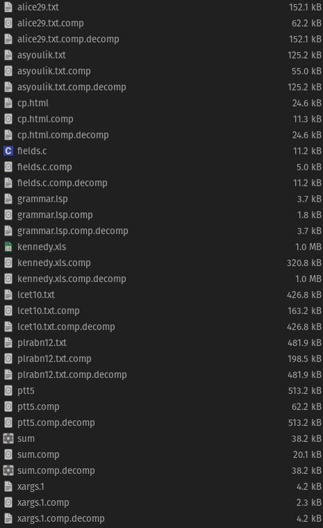

My Lempel-Ziv-Welch implementation, with a dynamic code table and increasing code-length.

Usage:
```bash
make # to generate executables
./encoder FILE_1 FILE_2 ... # creates FILE_1.comp, FILE_2.comp ...
./decoder FILE_1.comp FILE_2.comp ... # creates FILE_1.comp.decomp FILE_2.comp.decomp ...
```

I have a sneaky suspicion that forcing a smaller alphabet (by changing `STARTING_CODE_SIZE` in `lzw.hh`) will result in a bug with `bitio` logic (trailing `0`'s at the end.)
But that seems outside the scope of this, since I have to have the code size sufficiently big to accomodate arbitrary files.

I'd like to note a few things about a design choice, at least as a reminder to my future self. C++ seems to deal with characters primarily as integers,
so I decided to read everything as an integer, hoping to avoid the trouble of figuring whether things are ASCII, UNICODE or something else.
This choice meant that during encoding, I had to create a table that maps arbitrary sequences of numbers into codes.
My initial idea was to just convert the ints back to chars and save it in a string, but that didn't work well outside of ASCII.
A better idea is to map vectors of numbers into codes, but that would require me to write a hash function as well, because 
for some reason `unordered_map` is not predefined for vector keys. Since string is defined, I decided to store the numbers as strings,
with appending a comma in between so the sequence 1,2 will not be confused with 12.

This inelegance does cause me some pain, but I just happen to have more homework than usual, so I don't want to spend too much time on this.

The encoder output for [the Canterbury Corpus](https://corpus.canterbury.ac.nz/descriptions/) can be found [here](output.txt), but here is a screenshot as well:



